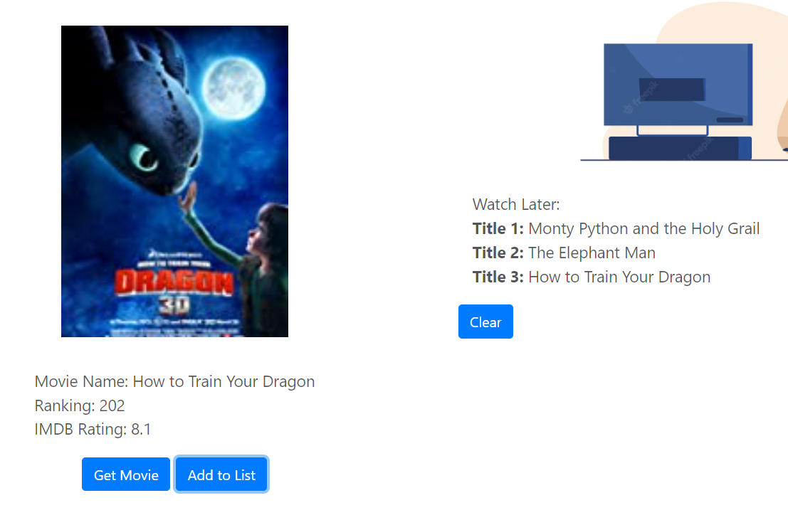
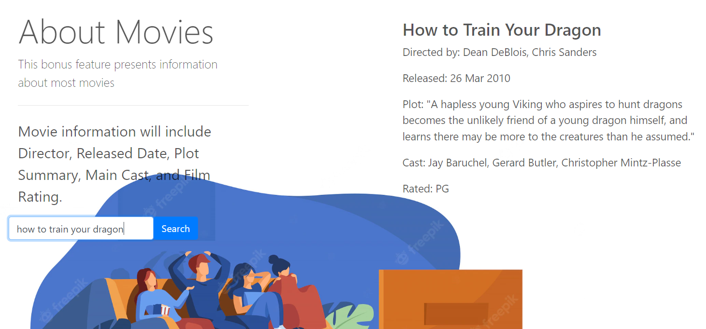

# Generating a Random To-Watch Movie List 

## Description
Ever wanted to watch a movie, but weren't sure of what to watch? With this app you can now pick from a selection of top-rated movies to create a to-watch list. The selections are drawn from the Top 250 Movies as rated on IMDB - simply open the link in a browser and click the "Get Movie" button. A random movie from the 250 will be displayed. If you like your selection, you can choose to save the movie to a list that is locally stored to be viewed later. 

If you aren't feeling so bold, there is a search bar below if you'd like more information on your selections. Just enter the name of the movie, and if the database can find it, it will display details such as rating, major cast members, plot, and more. 

### Authors
>- Franky
>- David Pascual
>- Sheryl Hu
 -- sherylhu@proton.me
>- Matthew Davis 
 -- matthewdavis1372@yahoo.com

### Technologies 
>- HTML
>- CSS
>- Javascript
>- Bootstrap
>- IMDB API
>- OMDB API

### How to use

- #### IMDB Section

We wanted an easy to use interface that offered several options to combat indecisiveness in movie selection. The first part of the application shows a button 
that will generate a movie from IMDB's top 250 movies. This button will render the random movie, the ranking, and the IMDB rating of said movie.
There are then two other buttons: an "Add to List" and a "Clear" button. The add to list button will add that randomized movie to a list in local storage.
The page will always display an up-to-date list of whichever movies you wanted to save for later. The clear button will clear this list so you are not jumbling 
up you list and making too long.

- #### OMDB Search Section

Near the bottom of page, there is a search function that uses OMDB's API. This is available in case you had a few specific movies in mind or wanted to find 
a little more information on the randomized movie from the previous functions. Simply type the title of a movie into the search bar and all the extra 
information you need. If the movie title does not exist within the API, a modal will pop up to let you know.
 
 - #### Header

On the top bar of the webpage, there is a header with a few useful buttons. The buttons "Main" and "Bonus" will scroll you directly to the IMDB and OMDB
programs respectively. 

### Images

### License
Copyright (c) 2022 Franky, David Pascual, Sheryl Hu, Matthew Davis.
This project is MIT licensed. 
